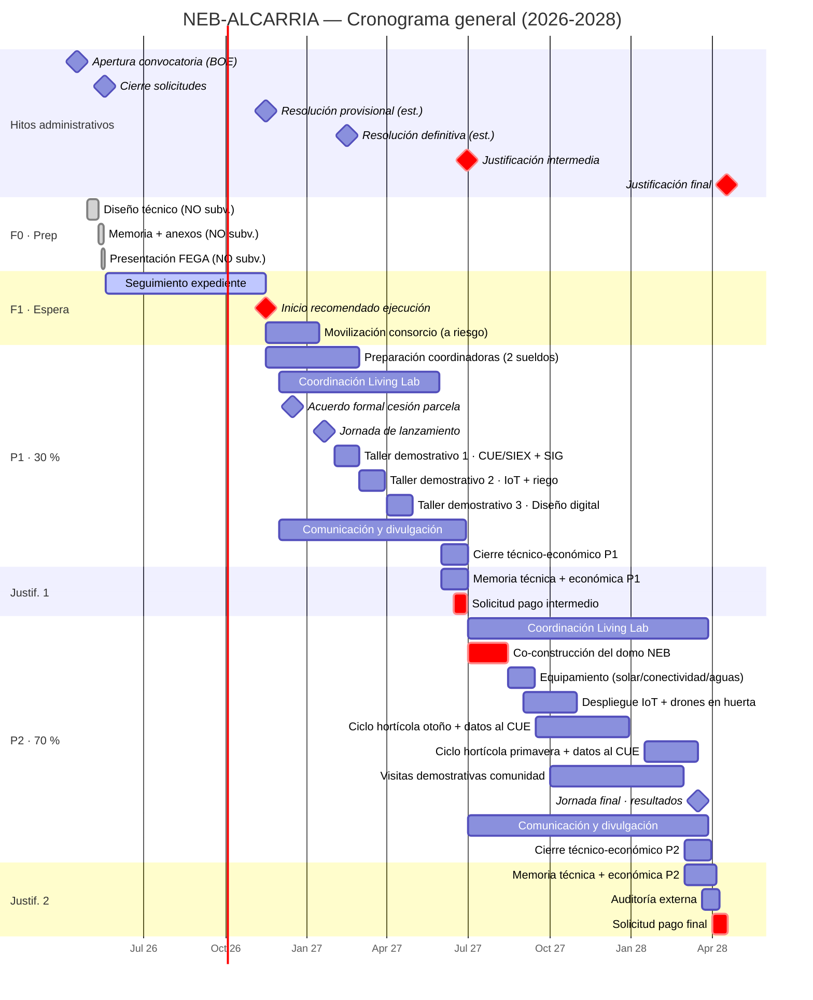
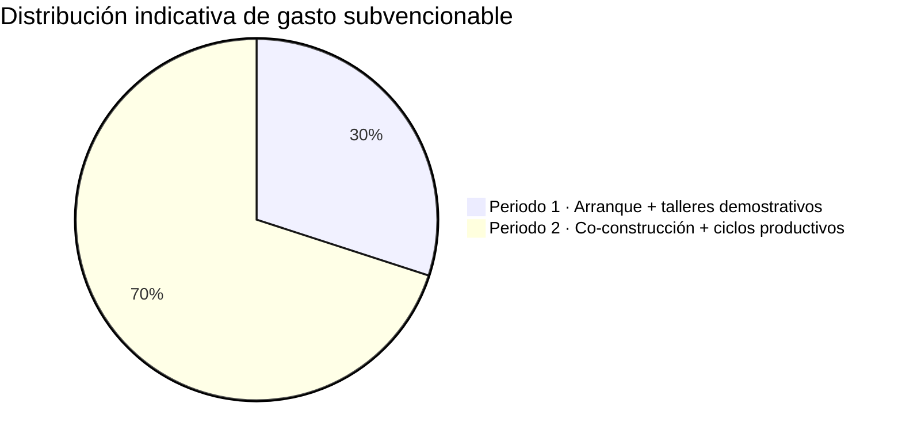

# NEB-ALCARRIA

**El Renacer Digital de la Horticultura.**
*Un puente entre el talento joven y el medio rural.*
*Beautiful, Sustainable & Together.*

---

## 1. Visión y enfoque metodológico (el espíritu NEB)

A menos de **una hora de distancia**, Madrid y la Alcarria viven realidades radicalmente opuestas: frente a una capital saturada, con un mercado de vivienda inasequible y condiciones de vida estresantes, la comarca de **Pastrana** ofrece un entorno excepcional, con una inmensa **riqueza cultural, paisajística e histórica**, infrautilizada por el drama de la **despoblación**.

NEB-ALCARRIA propone una visión romántica pero **tecnológicamente puntera**: ofrecer a las nuevas generaciones de ingenieros de la **UPM** una **experiencia vital cautivadora** que les demuestre que es posible establecerse en la Alcarria, disfrutar de un entorno extraordinario y desarrollar un trabajo **altamente cualificado y conectado**.

Bajo la filosofía de la **Nueva Bauhaus Europea (NEB)** —*Beautiful, Sustainable & Together*— no venimos a imponer tecnología: realizamos una **re-invención colectiva** de los espacios de vida, integrando **diseño transdisciplinar** y un fuerte **proceso participativo** con la población local. El objetivo último que perseguimos en el marco del **PEPAC 2023-2027** es **atraer y apoyar a los jóvenes profesionales** y facilitar el **desarrollo empresarial sostenible** en nuestras zonas rurales.

---

## 2. Presentación y consorcio

NEB-ALCARRIA es un **Living Lab** ubicado en la comarca de la Alcarria (**Pastrana, Guadalajara**) bajo el ideario de la **Nueva Bauhaus Europea**.

El consorcio promotor está formado por:

- **Universidad Politécnica de Madrid (UPM)** — a través del grupo de investigación **GeoSo2** (Grupo de Investigación Geoespacial y Dinámicas Territoriales para la Sostenibilidad), con la implicación principal de la **ETSI de Montes, Forestal y del Medio Natural** y la participación de los grados **GIF** (Ingeniería Forestal), **GIMN** (Ingeniería del Medio Natural) y **GITA** (Ingeniería de las Tecnologías Agroambientales). Abierto a otras escuelas (Telecos para IoT/conectividad, Agrónomos para horticultura, Industriales/Arquitectura para el domo) según necesidades técnicas.
- **Fundación COPRODELI** — impulsora del proyecto de desarrollo social y económico **Alcarria Encantada**.
- **Ayuntamiento de Pastrana** — entidad colaboradora que **cede la parcela experimental** de ~3.000 m² que vertebra la Fase 2 del proyecto.

---

## 3. Marco normativo y financiación

La iniciativa se diseña para concurrir a la convocatoria amparada por el **Real Decreto 251/2024, de 12 de marzo (BOE-A-2024-7035)**, que establece las bases reguladoras de las subvenciones para el **intercambio de conocimientos y actividades de formación e información** en el sector agroalimentario y forestal (**intervención 7201**).

El proyecto se alinea con el **Plan Estratégico de la PAC (PEPAC) 2023-2027**, con cofinanciación al **43 % por fondos europeos FEADER** y al **57 % por el Ministerio de Agricultura, Pesca y Alimentación**, y se apoya en el modelo del **Sistema de Conocimiento e Innovación Agrarios (SCIA / AKIS)**, fomentando un ecosistema de innovación con enfoque multiactor.

NEB-ALCARRIA concurre como **acción única bajo el Programa I.B (Actividades demostrativas)** del RD 251/2024: un **Living Lab** sobre el terreno que prueba, evalúa, muestra y divulga la digitalización de la microexplotación hortícola mediante **talleres demostrativos**, **jornadas de campo** y **transferencia tecnológica peer-to-peer** entre futuros profesionales y la comunidad local. Esta arquitectura de **una sola propuesta de actividades** —concentrada íntegramente en I.B— asegura la coherencia evaluativa, blinda la financiación del equipamiento físico (sólo I.B/II.B permiten amortización de maquinaria y software, art. 8.10 RD 251/2024) y atiende al consejo del MAPA de no mezclar líneas de acción dispares.

La propuesta integra explícitamente, por mandato del RD 251/2024, contenidos relativos al **Sistema de Información de Explotaciones Agrarias (SIEX)** y al **Cuaderno Digital de Explotación Agrícola (CUE)** —temáticas marcadas como prioritarias en la convocatoria.

---

## 4. Objetivos

El propósito central es **frenar la despoblación y fomentar el asentamiento de gente joven y cualificada** en la comarca, demostrando que la **horticultura digital de microexplotación** es una vía profesional viable, rentable y bella. Para ello, NEB-ALCARRIA persigue:
1. Facilitar la **implantación del CUE** generando comunidades de aprendizaje y gestión de dicho recurso.
2. **Capacitar a futuros profesionales** del sector en horticultura digital mediante **transferencia tecnológica peer-to-peer** dentro del Living Lab, conectada al cuaderno digital de explotación.
3. **Demostrar en condiciones reales** el huerto digital sobre la parcela experimental cedida por el **Ayuntamiento de Pastrana**.
4. **Co-construir un domo geodésico NEB** como base operativa, símbolo de cohesión y experiencia vital transformadora para los participantes.
5. **Tender un puente Madrid–Alcarria** que conecte la academia con la experiencia rural y fomente la integración de las nuevas generaciones en la España vaciada.

---

## 5. Alineación con la Nueva Bauhaus Europea

El proyecto encarna íntegramente los tres pilares del NEB Compass:

- **Beautiful — Bello.** El paisaje hortícola morisco tradicional regresará a las vegas de la Alcarria. El **domo geodésico**, co-construido con materiales locales (madera, corcho), dialoga con el paisaje alcarreño y elevará la microexplotación a **espacio inspirador y de alta calidad sensorial**, no a mera infraestructura productiva.
- **Sustainable — Sostenible.** La parcela funciona como demostrador de **bioeconomía circular** y **diseño regenerativo**: eficiencia hídrica extrema mediante IoT, autosuficiencia energética solar y ciclos cortos suelo-mesa.
- **Together — Juntos.** Los participantes del Living Lab serán el germen y el motor tractor de los huertos moriscos digitales donde estudiantes y sabios del lugar forjan vínculos que proyectan hacia el futuro la nueva realidad rural de la comarca.

---

## 6. Bases temporales (RD 251/2024)

El proyecto se ajusta a los plazos administrativos de la convocatoria amparada por el RD 251/2024, asumiendo el ciclo **2026 → 2028**:

| Hito | Fecha asumida | Fuente |
|------|---------------|--------|
| Apertura convocatoria (BOE) | 17 abril 2026 | RD 251/2024 / convocatoria FEGA |
| Cierre de solicitudes | 18 mayo 2026 (14:00 hora peninsular) | Convocatoria FEGA |
| Resolución provisional (estimada) | otoño 2026 (~oct-nov) | Procedimiento real ≈ 6–12 meses |
| Resolución definitiva (estimada) | finales 2026 / inicio 2027 | Plazo máx. 6 meses; en la práctica 10–12 |
| **Inicio Periodo 1 ejecución** | desde resolución provisional | Recomendación FEGA |
| **Cierre Periodo 1 ejecución** | 31 mayo 2027 | ≈30 % presupuesto |
| **Justificación intermedia (pago 1)** | **15 – 30 jun 2027** | Convocatoria |
| **Inicio Periodo 2 ejecución** | 1 julio 2027 | ≈70 % presupuesto |
| **Cierre Periodo 2 ejecución** | 31 marzo 2028 | Tope 3 años |
| **Justificación final (pago 2)** | **1 – 17 abr 2028** | Convocatoria |
| Auditoría externa | abr 2028 | ≤ 1 % subvención |

> **Penalización:** 1 % de la ayuda por cada día hábil de retraso en la presentación de cualquier solicitud de pago.

> **Periodo subvencionable (art. 8 RD 251/2024):** comprende **desde la presentación de la solicitud (18 mayo 2026) hasta la fecha límite de ejecución (31 marzo 2028)**. Todo lo previo —diseño técnico de la propuesta, memoria económica, redacción de anexos— **NO es subvencionable** y corre a cargo del consorcio.

> **Arranque recomendado:** aunque el periodo subvencionable empieza en mayo 2026, el FEGA recomienda **no ejecutar gasto hasta la resolución provisional** (~oct-nov 2026), que ya da "bastante seguridad jurídica" de ser beneficiario final. Antes de esa fecha, ejecutar implicaría gastar a riesgo. **Duración efectiva estimada del proyecto: ~17 meses** (nov 2026 → mar 2028).

---

## 7. Diagrama Gantt

> **Leyenda de secciones:** `F0 · Prep` = Fase 0 Preparación (NO subvencionable) · `F1 · Espera` = Fase 1 espera de resolución · `P1 · 30 %` = Periodo 1 de ejecución del Living Lab (arranque + talleres demostrativos · ~30 % presupuesto) · `Justif. 1` = Justificación intermedia · `P2 · 70 %` = Periodo 2 de ejecución del Living Lab (co-construcción + ciclos productivos · ~70 % presupuesto) · `Justif. 2` = Justificación final + auditoría.

---

## 8. Estructura de las actividades: una sola acción Living Lab

NEB-ALCARRIA es **una única acción demostrativa (Programa I.B)** —el Living Lab— articulada cronológicamente en **dos fases fuertemente interconectadas** dentro del mismo expediente: una primera fase de **arranque y talleres demostrativos de transferencia tecnológica** (P1) y una segunda fase de **inmersión presencial, co-construcción y ciclos productivos** (P2). Las **fechas administrativas son inamovibles**; las actividades técnicas se han colocado, en la medida de lo posible, dentro de su **ventana estacional** en la Alcarria.

**Aforos previstos:** 20–30 participantes por taller demostrativo · 10–20 en la inmersión presencial sobre el terreno (cumple holgadamente el mínimo de 10 participantes/actividad fijado por la Guía del Solicitante).

### 8.1 Fase 1 — Arranque del Living Lab y talleres demostrativos

La primera fase moviliza al consorcio, formaliza la cesión de la parcela y despliega **tres talleres demostrativos de transferencia tecnológica peer-to-peer** que ponen sobre la mesa, en condiciones reales, las herramientas digitales que la fase 2 desplegará a pleno rendimiento sobre la parcela. **Modalidad presencial** en espacio demostrativo del territorio (con apoyo virtual síncrono auxiliar limitado, sin desnaturalizar el carácter demostrativo). Evaluación según anexos del RD 251/2024: **≥80 % de asistencia + cuestionario de satisfacción** (evaluación interna, sin prueba de aprovechamiento). 1,5 h justificables de preparación por cada hora demostrada.

**Duración: 30 horas por taller demostrativo**, distribuidas en **10 h/semana × 3 semanas + 1 semana de cierre demostrativo aplicado**. Estructura interna:

- **18 h sesiones de transferencia tecnológica peer-to-peer** en espacio demostrativo (con apoyo virtual síncrono opcional).
- **9 h demostración guiada** con datasets reales del territorio, simulaciones y manejo de software sobre el terreno.
- **3 h cierre**: caso práctico aplicado + cuestionario de satisfacción.

| Taller | Edición | Contenidos demostrativos |
|--------|---------|--------------------------|
| **TD1 · Cuaderno Digital (CUE) y SIG para microexplotaciones** | feb 2027 | Demostración sobre el terreno de la cumplimentación de **SIEX** y **CUE** (obligatorio por convocatoria). **SIGPAC**, recintos, declaración. **SIG** aplicado a alta precisión en microexplotación: QGIS, teledetección, NDVI, gestión eficiente del territorio. |
| **TD2 · Sensores IoT y eficiencia hídrica en horticultura** | mar 2027 | Despliegue demostrativo de redes **IoT** (LoRa/NB-IoT), sensorización de humedad de suelo y meteo, **automatización del riego por goteo**, plataformas de datos, **volcado automatizado al CUE**. |
| **TD3 · Diseño digital de instalaciones agropecuarias ecosostenibles** | abr 2027 | Demostración de software **CAD** y cálculo estructural de pequeñas instalaciones de madera, **diseño regenerativo y bioeconomía circular**. Fundamentos del **domo geodésico** que se levantará en la Fase 2. |

### 8.2 Fase 2 — Inmersión presencial, co-construcción y ciclos productivos

La fase 2 traslada los tres talleres al terreno. Se realiza **100 % presencialmente** en Pastrana sobre parcelas experimentales —huertos particulares propuestos por los participantes o el **huerto piloto situado en la parcela experimental cedida por el Ayuntamiento de Pastrana**—, transformándolas en un **Living Lab** activo donde la filosofía NEB *Together* cobra vida. Los participantes trabajan **codo con codo con los "sabios del lugar"** y la comunidad local en un esquema de **innovación interactiva multiactor** (AKIS).

**Hitos demostrativos integrados:**

| Hito | Ventana | Descripción |
|------|---------|-------------|
| **H1 · Co-construcción del domo NEB** *(Beautiful + Together)* | jul–ago 2027 | Aplicación directa del TD3. Domo geodésico de madera con impregnación de corcho, **levantado a mano por los participantes en ~2 semanas**. Base operativa del Living Lab. |
| **H2 · Equipamiento autosuficiente** *(Sustainable)* | ago–sep 2027 | **Panel solar**, **conectividad** (Starlink u otros). Convierte el domo en espacio demostrativo de hábitat rural conectado y autosuficiente. |
| **H3 · Despliegue IoT sensores en la huerta** | sep–oct 2027 | Aplicación directa del TD2: red de **sensores de humedad y meteo**, **riego inteligente**, **mapeo dronístico** (RGB/multiespectral) para el seguimiento de las vegas hortícolas. |
| **H4 · Ciclo hortícola con CUE en producción** | sep 2027 – mar 2028 | Aplicación directa del TD1: dos ciclos de cultivo (otoño + primavera) con **volcado real de datos al Cuaderno Digital de Explotación**. Demostración empírica de rentabilidad y eficiencia hídrica de la microexplotación digitalizada. |

> **Nota UPM (al margen del expediente FEGA).** La participación combinada en los talleres demostrativos de la Fase 1 y la inmersión sobre el terreno de la Fase 2 podrá convalidarse internamente por UPM como prácticas curriculares/extracurriculares y, eventualmente, como título propio. **Esto no constituye entregable ni objetivo evaluable de la subvención**, que se mide exclusivamente por indicadores I.B (asistencia, satisfacción, divulgación, demostración).

### 8.3 Listado consolidado de actividades demostrativas (referencia Anexo II.B)

Operacionalmente, las dos fases narradas arriba se ejecutan como una **secuencia de 25 actividades demostrativas presenciales** (`A1`–`A25`), cada una de **≤ 2 días** (cumple Art. 5.6 RD 251/2024 y aclaración FEGA), agrupadas en **10 familias temáticas** (`F1`–`F10`) bajo el paraguas único del Living Lab. Cada actividad puede tener **una o varias ediciones** (mismo contenido, distintas fechas/lugares) para maximizar exposición y cubrir ventana estacional. Esta tabla es la **fuente de verdad** que se traslada a la sección 2.4 del Anexo II.B y al Anexo III (cronograma).

| Id | Familia | Actividad demostrativa | Duración | Ediciones | Prep (h) | Ventana(s) | Periodo |
|----|---------|------------------------|----------|-----------|---------:|------------|---------|
| **A1** | F1 · Concepto NEB | Concepto NEB aplicado a la microexplotación alcarreña | 1 d | 1 | 8 | ene 2027 | P1 |
| **A2** | F2 · CUE+SIG | Cumplimentación CUE/SIEX | 2 d | 2 | 32 | feb 2027 (E1) · sep 2027 (E2) | P1+P2 |
| **A3** | F2 · CUE+SIG | SIGPAC y declaración | 1 d | 1 | 8 | mar 2027 | P1 |
| **A4** | F2 · CUE+SIG | SIG QGIS + NDVI en campo | 2 d | 1 | 16 | abr 2027 | P1 |
| **A5** | F3 · IoT+riego | Despliegue red IoT en huerta | 2 d | 1 | 80 | sep 2027 | P2 |
| **A6** | F3 · IoT+riego | Demostración riego automatizado | 1 d | 2 | 32 | oct 2027 (E1) · feb 2028 (E2) | P2 |
| **A7** | F3 · IoT+riego | Volcado automatizado de datos al CUE | 1 d | 1 | 16 | oct 2027 | P2 |
| **A8** | F4 · Diseño digital | CAD instalaciones de madera | 2 d | 1 | 8 | may 2027 | P1 |
| **A9** | F4 · Diseño digital | Cálculo y planos del domo geodésico | 1 d | 1 | 8 | may 2027 | P1 |
| **A10** | F5 · Domo NEB | Levantamiento de la estructura del domo | 2 d | 1 | 160 | jul 2027 | P2 |
| **A11** | F5 · Domo NEB | Anclajes y fijaciones del domo | 1 d | 1 | 80 | jul 2027 | P2 |
| **A12** | F5 · Domo NEB | Cubierta y entelado del domo | 2 d | 1 | 40 | jul–ago 2027 | P2 |
| **A13** | F5 · Domo NEB | Acabado e impermeabilización con corcho | 1 d | 1 | 24 | ago 2027 | P2 |
| **A14** | F6 · Equipamiento | Instalación fotovoltaica | 1 d | 1 | 24 | ago 2027 | P2 |
| **A15** | F6 · Equipamiento | Conectividad satelital y red | 1 d | 1 | 12 | ago 2027 | P2 |
| **A16** | F7 · Despliegue terreno | Despliegue de sensores en la huerta | 2 d | 1 | 40 | sep 2027 | P2 |
| **A17** | F7 · Despliegue terreno | Vuelo dronístico RGB + multiespectral | 1 d | 2 | 32 | oct 2027 (E1) · abr 2028 (E2) | P2 |
| **A18** | F8 · Ciclo productivo | Jornada de inicio del ciclo otoño | 1 d | 1 | 32 | sep 2027 | P2 |
| **A19** | F8 · Ciclo productivo | Seguimiento medio ciclo otoño | 1 d | 1 | 64 | nov 2027 | P2 |
| **A20** | F8 · Ciclo productivo | Cosecha + lectura de datos otoño | 1 d | 1 | 32 | dic 2027 | P2 |
| **A21** | F8 · Ciclo productivo | Jornada de inicio del ciclo primavera | 1 d | 1 | 48 | feb 2028 | P2 |
| **A22** | F8 · Ciclo productivo | Cosecha + lectura de datos primavera | 1 d | 1 | 64 | abr 2028 | P2 |
| **A23** | F9 · Cierre | Jornada final de resultados del Living Lab | 1 d | 1 | 8 | abr 2028 | P2 |
| **A24** | F10 · Software open-source | Configuración del cuaderno digital open-source para microexplotación hortícola (FarmOS adaptado · TRL 5 → TRL 7) | 1 d | 1 | 440 | mar 2027 | P1 |
| **A25** | F10 · Software open-source | Configuración del SIG open-source (QGIS + QField) para microexplotaciones (TRL 5 → TRL 7) | 1 d | 1 | 405 | abr 2027 | P1 |

**Totales:** 25 actividades · 29 ediciones · 36 días-actividad (11 en P1, 25 en P2) · **~1.770 h de personal de apoyo** para acondicionamiento previo · aforo objetivo 15–25 participantes/edición · ~60–90 participantes únicos. Mínimo legal: ≥10 participantes/edición (Guía del Solicitante FEGA).

#### Madurez tecnológica (TRL) y estrategia de progresión

El stack tecnológico de NEB-ALCARRIA arranca en **TRL 5** (componentes individualmente validados en entornos relevantes pero no integrados como producto unificado para microexplotación hortícola en España): FarmOS, QGIS+QField, IoT LoRa, dron multiespectral, Sentinel-2.

- **P1 — Configuración (A24, A25): TRL 5 → TRL 7.** El equipo UPM integra el conjunto en un **sistema completo y operativo** adaptado al caso de uso: cuaderno digital con conectores SIGPAC y SIEX, alertas Vademécum MAPA, plantillas QGIS para microexplotación, conexión Sentinel-2 para NDVI y trazabilidad Global GAP. Al final de P1 el sistema está **desplegado en el servidor del Living Lab y listo para uso real**.
- **P2 — Demostración + feedback: TRL 7 → TRL 8.** Las 17 actividades demostrativas de P2 sobre la parcela real, con ciclos productivos completos (otoño + primavera) y feedback iterativo de profesionales del sector y la comunidad local, **validan el sistema en su entorno operativo definitivo** y elevan su madurez a TRL 8 (sistema completo y cualificado).

Esta progresión es coherente con la línea estratégica **A) CUE** del baremo y con la **innovación interactiva multiactor (AKIS)** del criterio B4.

> **A1 · Concepto NEB aplicado a la microexplotación alcarreña** abre el Living Lab con una **jornada multiactor de inmersión territorial** en Pastrana: presentación del marco *Beautiful, Sustainable & Together* aplicado al caso NEB-ALCARRIA, visita a la parcela experimental, dinámica de co-creación con la comunidad local, ejemplos de proyectos NEB-aligned en otros territorios europeos y lanzamiento del programa demostrativo. Sienta el lenguaje y los valores que vertebran las 22 actividades restantes.

#### Acondicionamiento previo del Living Lab (personal de apoyo)

El RD 251/2024 (Art. 8.1.a.1.**ii**) reconoce expresamente como gasto subvencionable la figura de **Personal de apoyo** —*"aquel personal no docente, encargado de dar soporte al desarrollo de las actividades formativas, demostrativas y divulgativas"*—, que es **novedad de esta convocatoria**. La FAQ 3.34 del MAPA aclara que **NO le aplica el tope de 1,5 h de preparación por hora impartida** (eso es solo para personal docente); su único límite es el laboral estándar de **1.720 h anuales por trabajador**. Esto permite imputar todo el trabajo de acondicionamiento físico previo a cada actividad demostrativa, lo que es **clave** porque una jornada demostrativa de ≤ 2 días no puede ejecutar materialmente todo el proceso (p. ej., los 20 anclajes del domo): la demostración muestra una **muestra representativa en condiciones reales** y el resto queda preparado por el personal de apoyo.

**Partidas presupuestarias** (hoja `PRESUPUESTO P.I.B-Agrupación` del Anexo I y Anexo XXII):

- **A.2 Personal de apoyo externo** — tope **90 €/h IVA excl.** (carpintería externa, instaladores eléctricos, técnicos IoT subcontratados).
- **A.4 Personal de apoyo propio** — coste salarial bruto / 1.720 h anuales (técnicos UPM y COPRODELI dedicados al acondicionamiento).

| Id | Tareas preparatorias | Horas | Perfil personal de apoyo |
|----|---------------------|------:|--------------------------|
| A1 | Logística del espacio, materiales conceptuales, dossier de bienvenida | 8 | Coordinación + diseño |
| A2 | Preparación de datasets reales Pastrana, configuración de equipos (×2 ed) | 32 | Técnico/a GIS |
| A3 | Configuración software SIGPAC, casos de estudio reales | 8 | Técnico/a GIS |
| A4 | Preparación de imágenes satelitales, calibración de instrumentos de campo | 16 | Técnico/a GIS + drones |
| A5 | **Pre-cableado y configuración de gateways LoRa, montaje del servidor IoT** (la demo despliega 3–4 sensores; el resto queda preinstalado para que la red sea operativa) | 80 | Técnico/a IoT |
| A6 | Calibración de válvulas, programación de la lógica de riego (×2 ed) | 32 | Técnico/a IoT + agronómico |
| A7 | Configuración del pipeline de datos, integración con la plataforma CUE | 16 | Técnico/a software |
| A8 | Preparación de software CAD y modelos pre-cargados | 8 | Ingeniero/a CAD |
| A9 | Hojas de cálculo del domo, ejemplos pre-resueltos | 8 | Ingeniero/a estructural |
| A10 | **Precorte de listones de madera, perforación de uniones, marcado y acopio** (la demo monta un módulo del domo; el resto del material queda precortado) | 160 | Carpintero/a |
| A11 | **Replanteo de los 20 puntos del domo, preinstalación de 16 anclajes** (la demo ejecuta los 4 anclajes restantes) | 80 | Albañil + topógrafo/a |
| A12 | Tratamiento previo de paños de tela, prefijación parcial de la cubierta | 40 | Carpintero/a |
| A13 | Preparación de la mezcla corcho-aglomerante, mock-up parcial | 24 | Carpintero/a |
| A14 | **Pre-cableado fotovoltaico, montaje parcial del soporte** (la demo iza y conecta los paneles) | 24 | Instalador/a eléctrico |
| A15 | Preconfiguración del router/red, preinstalación del soporte de antena | 12 | Técnico/a telecom |
| A16 | Calibración de sensores en banco, configuración previa de cada nodo | 40 | Técnico/a IoT |
| A17 | Calibración de cámaras del dron, planes de vuelo, datasets de referencia (×2 ed) | 32 | Operador/a de dron |
| A18 | Laboreo de la parcela, abonado, sustratos, plántulas, riego inicial | 32 | Técnico/a agronómico |
| A19 | Mantenimiento del cultivo entre A18 y A19 (riego, escardado, lectura de sensores) | 64 | Técnico/a agronómico |
| A20 | Cosecha previa + preparación de la presentación de datos del ciclo otoño | 32 | Técnico/a agronómico |
| A21 | Mantenimiento intercampaña + laboreo y siembra del ciclo primavera | 48 | Técnico/a agronómico |
| A22 | Mantenimiento del ciclo primavera + cosecha + preparación de datos | 64 | Técnico/a agronómico |
| A23 | Edición de vídeo de síntesis, materiales gráficos de la jornada final | 8 | Comunicación |
| **Total** |  | **868** |  |

Esta estimación se afina al construir el presupuesto definitivo y se traslada literal a la **sección 3.5 Recursos humanos** de cada ficha de actividad del Anexo II.B y al detalle del Anexo XXII (Memoria presupuestaria). En la justificación posterior cada hora se acredita con el **certificado por trabajador (Anexo XVI)** firmado por responsable y trabajador.

### 8.4 Líneas transversales

| Línea | P1 | P2 | Notas |
|------|----|----|-------|
| **Coordinación + preparación** | 2 coordinadoras (UPM + COPRODELI) preparando los talleres y el Living Lab desde nov 2026 | continuo | Sueldos justificables como personal propio (≤20 % de los costes directos). Ejecución a riesgo hasta resolución provisional. |
| **Comunicación y divulgación** | continuo | continuo | Web, RRSS, podcast, vídeo, presencia en **AEI-Agri** y red **AKIS**. Mención **FEADER + MAPA** obligatoria. Comunicación previa al FEGA con ≥10 días de antelación por actividad nueva (≥7 días para modificaciones). |
| **Evaluación AKIS / SCIA** | seguimiento intermedio (jun 2027) | evaluación final (mar 2028) | Indicadores I.B: asistencia ≥80 %, evaluación interna de satisfacción, número de participantes que completan la actividad, datos volcados al CUE, alcance divulgativo. |

---

## 9. Reparto presupuestario indicativo

Recomendación de FEGA: **30 % en P1 / 70 % en P2** para maximizar la ejecución y dejar margen ante la liberación tardía de la resolución.

---

## 10. Impacto y resultados esperados

A través del intercambio constante de experiencias en este Living Lab, NEB-ALCARRIA aspira a:

- **Capacitar a 60–90 futuros profesionales** del sector agroalimentario en horticultura digital de microexplotación, vertebrados por el **Cuaderno Digital de Explotación**, mediante los **talleres demostrativos** de la Fase 1 y la **inmersión presencial** en los hitos H1–H4 sobre el terreno.
- **Demostrar empíricamente** sobre 3.000 m² reales que la **microexplotación hortícola digitalizada** es **rentable** y **altamente eficiente** en uso de agua y suelo, con datos volcados al CUE en producción.
- **Co-construir un domo geodésico NEB** como pieza emblemática, replicable, sostenible, parcialmente autosuficiente y plenamente conectada.
- **Activar un puente Madrid–Alcarria** que ofrezca a estudiantes UPM una vía vital y profesional concreta hacia el medio rural.
- **Fortalecer las redes de colaboración** del ecosistema **AKIS / SCIA** y la **implantación progresiva del cuaderno digital** —prioridad explícita del MAPA en la convocatoria.
- **Revitalizar la Alcarria** con un modelo **económicamente viable, medioambientalmente regenerativo y socialmente inspirador**, replicable en otros territorios de la España rural.

Al alinear **alta tecnología** con **patrimonio y belleza rural**, creamos el caldo de cultivo perfecto para combatir la despoblación y fomentar el asentamiento definitivo de talento joven en el territorio.

---

## 11. Supuestos y puntos a confirmar

- **Eje único** consolidado en torno al **CUE + horticultura digital de microexplotación**, atendiendo a la advertencia explícita del MAPA en el Info Day: *"evitar presentar eventos aislados sin un proyecto estructurado"* y *"no mezclar líneas de acción dispares"*.
- **Acción única bajo Programa I.B (Living Lab)** —decisión consolidada—: una sola propuesta de actividades concentra los talleres demostrativos y la inmersión presencial. Esta arquitectura (i) asegura la financiación de inversiones (sólo I.B/II.B amortizan equipo y software, art. 8.10 RD 251/2024), (ii) supera con holgura el umbral mínimo de **70 000 €** por propuesta, y (iii) evita el riesgo de evaluadores ciegos cruzando dos memorias separadas.
- **Disciplina léxica I.B**: el documento sustituye sistemáticamente vocabulario académico (curso, alumnos, examen, microcredencial, ECTS) por terminología demostrativa (Living Lab, taller demostrativo, participantes, evaluación interna de satisfacción, transferencia tecnológica peer-to-peer). Cualquier eventual convalidación UPM en ECTS o título propio se gestionará **internamente al margen del expediente FEGA**.
- **Límites operativos I.B aplicables**: inversiones (amortización de equipo, drones, IoT, software) topadas al **50 % de los gastos directos** con intensidad de ayuda **65 %**; personal externo **90 €/h IVA excl.**, con **1,5 h de preparación justificables por hora demostrada**; coordinación ≤ 20 % de gastos directos.
- **Cesión formal de la parcela de 3.000 m²** por el Ayuntamiento de Pastrana: pendiente de **convenio firmado** antes de la presentación de la solicitud (componente A1/A2 del baremo).
- **Duración**: el RD **no fija mínimo**, sólo el **máximo de 3 años**. Este proyecto plantea ~17 meses efectivos (nov 2026 → mar 2028), en línea con la duración "de un año, año y medio" recomendada por FEGA en la jornada de la convocatoria.
- **Subvencionabilidad (art. 8 RD 251/2024)**: el periodo subvencionable empieza en la presentación de la solicitud. **Toda la Fase 0 (diseño técnico, memoria, anexos) es NO subvencionable** y la asume el consorcio.
- **Inicio de ejecución**: arranca con la **resolución provisional** (no la definitiva) porque, aunque legalmente "no crea derecho alguno", FEGA confirma que en la práctica tiene "bastante seguridad jurídica". Ejecutar antes implicaría gastar a riesgo.
- **Fechas asumidas** para resolución provisional/definitiva basadas en el plazo legal (6 meses) y la praxis (10–12 meses) descrita en la jornada FEGA. **Ajustar al publicarse la resolución real.**
- **Justificaciones (15–30 jun 2027 y 1–17 abr 2028)** son las indicadas en la convocatoria actual; **revisar contra la convocatoria publicada en BDNS/BOE** del ciclo en el que se concurra.
- **No hay anticipo**: el consorcio debe disponer de tesorería para ejecutar antes del pago intermedio (jun 2027) y final (abr 2028).
- **Inclusión obligatoria** de contenidos SIEX + CUE en el TD1 (mandato del RD 251/2024 cuando la propuesta toca nutrición sostenible o fitosanitarios).
- **Domo, autosuficiencia y narrativa NEB ampliada**: si se desea desarrollar un proyecto-hermano más ambicioso de hábitat rural, valorar concurrencia paralela a **NEB Facility / LIFE / Interreg**, sin mezclar con esta solicitud (el propio MAPA recomienda presentar líneas dispares como solicitudes separadas).

---

*Documento elaborado a partir de las fuentes y conversaciones contenidas en el cuaderno NotebookLM "Agro-Forestry Knowledge Transfer and Advisory Services Regulations" (`286b8ce3-d766-4c90-a503-7679bc5edc3d`).*
